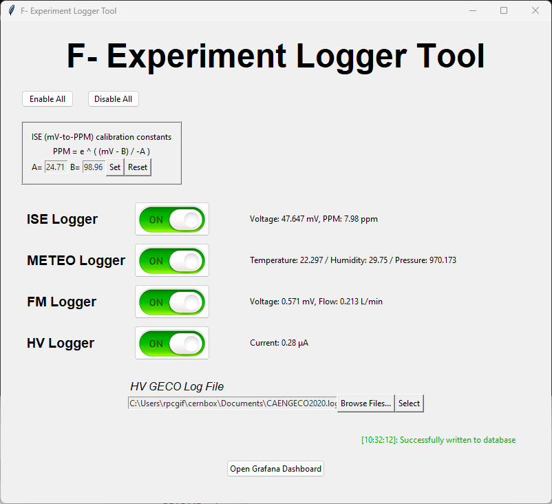

# F- Production Experiment: Logger Tool
*For Building 904 @ CERN*



## Purpose
This tool was specifically developed for the F- Production Experiment at CERN, which involves irradiating fluorinated gases in a straw detector
and measuring the production rate of F- in the gas output.  
(This is done with hopes of learning more about correlated F radicals.)  
The experiment requires the logging of several sensors, including:
- ... an ISE (Ion Selective Electrode) connected to a Yoctopuce milliVolt reader to detect the concentration of F- ions in the test solution
- ... a Yoctopuce METEO sensor to detect environmental parameters (humidity, temperature, atmospheric pressure)
- ... a Yoctopuce flowmeter to log the rate of gas input flow to the straw detector
- ... a high-voltage (HV) sensor to measure the supplied voltage to the straw detector
  - (This logging is done locally by an external program; the tool parses the logfile to write to a CERN database)

This project aggregates multiple loggers into a centralized tool. They can be enabled or disabled independently,
which is especially useful for the frequent removal of the ISE sensor (as it shouldn't remain in the test solution for
over 6 hours).

## Required Modules and Usage
The tool requires the following Python modules to be installed:
- InfluxDB (influxdb)
- Yoctopuce (yoctopuce)
- SciPy (scipy)

A file named `config_db.py` is also required in the project's root directory.
This configuration file holds sensitive database information, and therefore isn't included in this repo.
Its format should be as follows:
```
DB_HOST = "db.host.url"
DB_PORT = 1234
DB_USERNAME = "db_username"
DB_PASSWORD = "db_password"
DB_DATABASE = "db_database"
```

A file named `default_calibration.txt` must be placed in the project's root directory.
It's a simple text file containing two floats, the values for 'A' and 'B' in the ISE's 'mv-to-PPM' conversion formula.
`PPM = e ^ ((mV - B) / -A)`  
These values are separated by a single space and should take the format: `24.71 98.96`  
(This file will be updated automatically when these values are set from within the program,
so nothing further is required.)

The program can be started simply by running `main.py` through the Python command-line.
